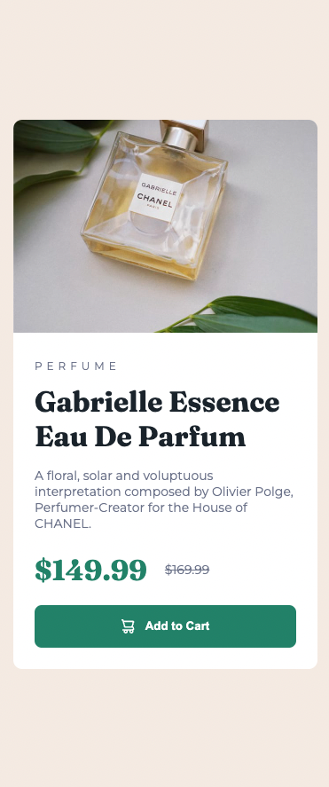

# Frontend Mentor - Product preview card component solution

This is a solution to the [Product preview card component challenge on Frontend Mentor](https://www.frontendmentor.io/challenges/product-preview-card-component-GO7UmttRfa). Frontend Mentor challenges help you improve your coding skills by building realistic projects. 

## Table of contents

- [Overview](#overview)
  - [The challenge](#the-challenge)
  - [Screenshot](#screenshot)
  - [Links](#links)
- [My process](#my-process)
  - [Built with](#built-with)
  - [What I learned](#what-i-learned)
  
## Overview

### The challenge

Users should be able to:

- View the optimal layout depending on their device's screen size
- See hover and focus states for interactive elements

### Screenshot

- Mobile View



- Tablet + Desktop View


### Links

- Solution URL: [(https://github.com/fvdumah/Product-Preview-Card)]
- Live Site URL: [(https://fvdumah.github.io/Product-Preview-Card/)]

## My process

### Built with

- Semantic HTML5 markup
- CSS custom properties
- Flexbox
- Mobile-first workflow

### What I learned

I learnt that we could use picture element from MDN documentation to display image based on viewport width.
I did not end up using it as although it was working, I was having issues defining the width of the desktop image.

```css
<picture>
  <source srcset="/media/cc0-images/surfer-240-200.jpg" media="(orientation: portrait)" />
  
</picture>

```
## Author

- Website - [fvdumah](https://github.com/fvdumah)
- Frontend Mentor - [@fvdumah](https://www.frontendmentor.io/profile/fvdumah)
